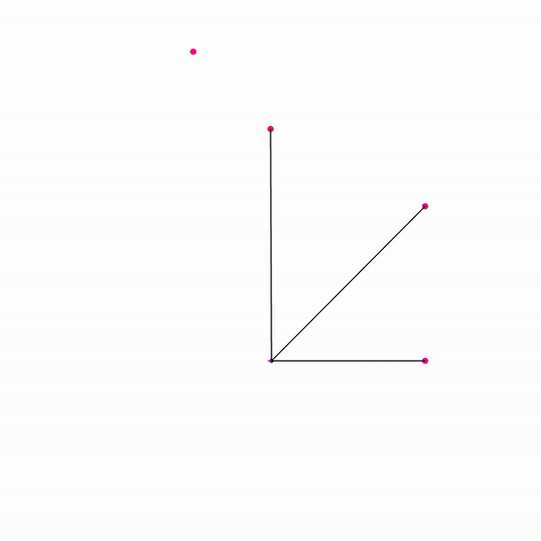
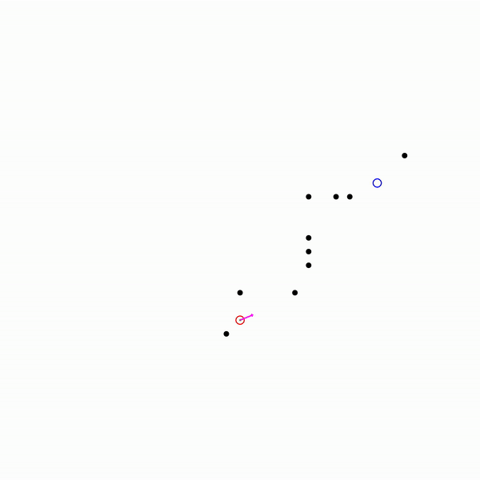
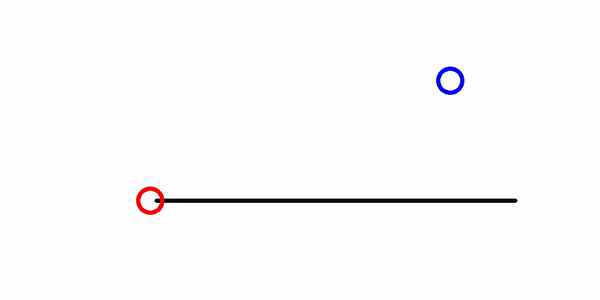

# CppRobotics

This is the cpp implementation of the [PythonRobotics](https://github.com/AtsushiSakai/PythonRobotics)

## Requirment
- cmake
- opencv 3.3
- Eigen 3
- ipopt / CppAD (for MPC convex optimization)
- ~~ROS~~ (*To make the repo lightweight :)*)

## Build
     $ mkdir build
     $ cd build
     $ cmake ../
     $ make -j 8

Find all the executable files in ***build/bin***.

# Table of Contents
* [Localization](#localization)
    * [Extended kalmam filter](#extended-kalman-filter-localization)
    * [Particle filter](#particle-filter-localization)
    * Histogram filter
* [Mapping](#mapping)
    * Gaussian grid map
* [SLAM](#SLAM)
    * FastSLAM 1.0
* [Path Planning](#path-planning)
    * [Dynamic Window Approach](#dynamic-window-approach)
    * [Model Predictive Trajectory Generator](#model-predictive-trajectory-generator)
    * [Cubic Spline Planner](#cubic-spline-planner)
    * [State Lattice Planner](#state-lattice-planner)
    * [Frenet Frame Trajectory](#frenet-frame-trajectory)
* [Path Tracking](#path-tracking)
    * [LQR Sterring Control](#lqr-steering-control)
    * [LQR Speed and Steering Control](#lqr-speed-and-steering-control)
    * [Model Predictive Speed and Steering Control](#mpc-speed-and-steering-control)

# Localization
## Extended Kalman Filter Localization
* green line: the groundtruth trajectory
* black line: dead reckoning
* red points: observations (e.g. GPS)
* blue line: estimated positions

<!--  -->

[Probabilistic Robotics](http://www.probabilistic-robotics.org/)

## Particle Filter Localization
* green line: the groundtruth trajectory
* black line: dead reckoning
* red points: landmarks
* blue line: estimated positions

<!--  -->

[Probabilistic Robotics](http://www.probabilistic-robotics.org/)

# Path Planning
## Dynamic Window Approach
* blue circle: the target point
* red circle: the robot

<!--  -->

[The dynamic window approach to collision avoidance](https://ieeexplore.ieee.org/document/580977)

## Model Predictive Trajectory Generator
This part is based on the bicycle motion model.
* blue circle: the target point
* red circle: the initial point

<!--  -->

## Cubic Spline Planner

<!--  -->

## State Lattice Planner
* blue circle: the target point
* red circle: the initial point

<!--  -->

[State Space Sampling of Feasible Motions for High-Performance Mobile Robot Navigation in Complex Environments](https://www.ri.cmu.edu/pub_files/pub4/howard_thomas_2008_1/howard_thomas_2008_1.pdf)

## Frenet Frame Trajectory

* black line: the planned spline path
* red circle: the obstacle
* blue circle: the planned trajectory
* green circle: the real-time position of robot

[Optimal Trajectory Generation for Dynamic Street Scenarios in a Frenet Frame](https://www.researchgate.net/publication/224156269_Optimal_Trajectory_Generation_for_Dynamic_Street_Scenarios_in_a_Frenet_Frame)

# Path Tracking
## LQR Steering Control
* black line: the planned spline path
* red circle: the position under lqr control

## LQR Speed and Steering Control
* black line: the planned spline path
* red circle: the position under lqr control

## MPC Speed and Steering Control
* black line: the planned spline path
* blue line: the passed path
* yellow cross: the reference trajectory for MPC
(To compile this part, you need to uncomment the related lines in CMakeLists.txt and install CppAD and IPOPT.)

